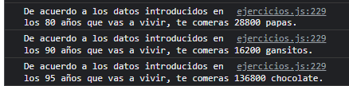
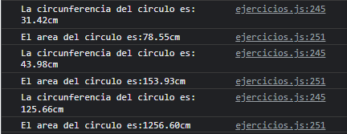
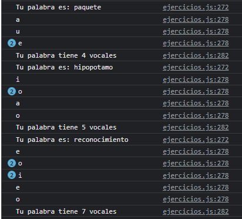

# Ejercicios de la clase N°3

1.  Crea una función que reciba como parámetro la edad de un perro y permita calcular la edad actual en años humanos del mismo y lo muestre en consola (solicita los parámetros que consideres necesarios por consola).

``` js
function edadPerrosHumanos(edad, raza) {


    if (raza === 'P' && edad < 16) {
        switch (edad) {
            case 1:
                console.log('Tu perro tiene 15 años humanos');
                break;
            case 2:
                console.log('Tu perro tiene 23 años humanos');
                break;
            case 3:
                console.log('Tu perro tiene 28 años humanos');
                break;
            case 4:
                console.log('Tu perro tiene 32 años humanos');
                break;
            case 5:
                console.log('Tu perro tiene 36 años humanos');
                break;
            case 6:
                console.log('Tu perro tiene 40 años humanos');
                break;
            case 7:
                console.log('Tu perro tiene 44 años humanos');
                break;
            case 8:
                console.log('Tu perro tiene 48 años humanos');
                break;
            case 9:
                console.log('Tu perro tiene 52 años humanos');
                break;
            case 10:
                console.log('Tu perro tiene 56 años humanos');
                break;
            case 11:
                console.log('Tu perro tiene 60 años humanos');
                break;
            case 12:
                console.log('Tu perro tiene 64 años humanos');
                break;
            case 13:
                console.log('Tu perro tiene 68 años humanos');
                break;
            case 14:
                console.log('Tu perro tiene 72 años humanos');
                break;

            default:
                console.log('Tu perro tiene 76 años humanos');
                break;
        }
    } if (raza === 'M' && edad < 16) {
        switch (edad) {
            case 1:
                console.log('Tu perro tiene 15 años humanos');
                break;
            case 2:
                console.log('Tu perro tiene 24 años humanos');
                break;
            case 3:
                console.log('Tu perro tiene 29 años humanos');
                break;
            case 4:
                console.log('Tu perro tiene 34 años humanos');
                break;
            case 5:
                console.log('Tu perro tiene 37 años humanos');
                break;
            case 6:
                console.log('Tu perro tiene 42 años humanos');
                break;
            case 7:
                console.log('Tu perro tiene 47 años humanos');
                break;
            case 8:
                console.log('Tu perro tiene 51 años humanos');
                break;
            case 9:
                console.log('Tu perro tiene 56 años humanos');
                break;
            case 10:
                console.log('Tu perro tiene 60 años humanos');
                break;
            case 11:
                console.log('Tu perro tiene 65 años humanos');
                break;
            case 12:
                console.log('Tu perro tiene 69 años humanos');
                break;
            case 13:
                console.log('Tu perro tiene 74 años humanos');
                break;
            case 14:
                console.log('Tu perro tiene 78 años humanos');
                break;

            default:
                console.log('Tu perro tiene 83 años humanos');
                break;
        }
    } if (raza === 'X' && edad < 16) {
        switch (edad) {
            case 1:
                console.log('Tu perro tiene 14 años humanos');
                break;
            case 2:
                console.log('Tu perro tiene 22 años humanos');
                break;
            case 3:
                console.log('Tu perro tiene 29 años humanos');
                break;
            case 4:
                console.log('Tu perro tiene 34 años humanos');
                break;
            case 5:
                console.log('Tu perro tiene 40 años humanos');
                break;
            case 6:
                console.log('Tu perro tiene 45 años humanos');
                break;
            case 7:
                console.log('Tu perro tiene 50 años humanos');
                break;
            case 8:
                console.log('Tu perro tiene 55 años humanos');
                break;
            case 9:
                console.log('Tu perro tiene 61 años humanos');
                break;
            case 10:
                console.log('Tu perro tiene 66 años humanos');
                break;
            case 11:
                console.log('Tu perro tiene 72 años humanos');
                break;
            case 12:
                console.log('Tu perro tiene 77 años humanos');
                break;
            case 13:
                console.log('Tu perro tiene 82 años humanos');
                break;
            case 14:
                console.log('Tu perro tiene 88 años humanos');
                break;

            default:
                console.log('Tu perro tiene 93 años humanos');
                break;
        }
    } if (raza === 'XL' && edad < 16) {
        switch (edad) {
            case 1:
                console.log('Tu perro tiene 14 años humanos');
                break;
            case 2:
                console.log('Tu perro tiene 20 años humanos');
                break;
            case 3:
                console.log('Tu perro tiene 28 años humanos');
                break;
            case 4:
                console.log('Tu perro tiene 35 años humanos');
                break;
            case 5:
                console.log('Tu perro tiene 42 años humanos');
                break;
            case 6:
                console.log('Tu perro tiene 49 años humanos');
                break;
            case 7:
                console.log('Tu perro tiene 56 años humanos');
                break;
            case 8:
                console.log('Tu perro tiene 64 años humanos');
                break;
            case 9:
                console.log('Tu perro tiene 71 años humanos');
                break;
            case 10:
                console.log('Tu perro tiene 78 años humanos');
                break;
            case 11:
                console.log('Tu perro tiene 86 años humanos');
                break;
            case 12:
                console.log('Tu perro tiene 93 años humanos');
                break;
            case 13:
                console.log('Tu perro tiene 101 años humanos');
                break;
            case 14:
                console.log('Tu perro tiene 108 años humanos');
                break;

            default:
                console.log('Tu perro tiene 115 años humanos');
                break;
        }
    } else {
        // console.log('Los datos que ingresaste son invalidos, por favor introdice valores permitidos ');
    }

}

edadPerrosHumanos(5, 'P');
edadPerrosHumanos(5, 'M');
edadPerrosHumanos(5, 'X');
edadPerrosHumanos(5, 'XL');
```


2. Crea una función que reciba por parámetro la edad máxima a la que te gustaría llegar (sin bromas por favor) y el número de tu bocadillo favorito que te gusta comer por día, esta debe regresar por consola cuanta cantidad de ese producto necesitarías para poderlo comer por lo que te resta de vida (solicita los parámetros que consideres necesarios por consola).

``` js
function bocadillosEnVida(edadMaxima, bocadillo, numeroBocadillos) {

    let res = (edadMaxima * 360) * numeroBocadillos;
    console.log(`De acuerdo a los datos introducidos en los ${edadMaxima} años que vas a vivir, te comeras ${res} ${bocadillo}.`);
}

bocadillosEnVida(80, 'papas', 1);
bocadillosEnVida(90, 'gansitos', 0.5);
bocadillosEnVida(95, 'chocolate', 4);
```



3. Crea una función que calcule la circunferencia y el área de un círculo (usa funciones anidadas) y regrese por consola los resultados obtenidos (solicita los parámetros que consideres necesarios por consola).

``` js
function circunferenciaCirculo(radioCirculo) {

    let circunferencia = ((2 * (Math.PI)) * radioCirculo).toFixed(2);

    console.log(`La circunferencia del circulo es: ${circunferencia}cm`);


    function areaCirculo(circunferencia, radioCirculo) {
        let area = ((circunferencia * radioCirculo) / 2).toFixed(2)

        console.log(`El area del circulo es:${area}cm`);
    }

    return areaCirculo(circunferencia, radioCirculo);

}

circunferenciaCirculo(5);
circunferenciaCirculo(7);
circunferenciaCirculo(20);
```



4. Crea una función que convierta la temperatura en grados Celsius, Fahrenheit y Kelvin en ese orden y con base en el resultado anterior calcular los siguientes para mostrarlos en consola (funciones anidadas o por separado) (solicita los parámetros que consideres necesarios por consola).


5. Crea una función que con base en la palabra ingresada te diga cuantas vocales tiene en total y desgloce la cantidad por cada vocal de la misma (solicita los parámetros que consideres necesarios por consola).

``` js 
function cuentaVocales(palabra) {
    let counter = 0;
    console.log(`Tu palabra es: ${palabra}`);
    for (let i = 0; i < palabra.length; i++) {
        if (palabra[i] === "a" || palabra[i] === "e" || palabra[i] === "i" || palabra[i] === "o" || palabra[i] === "u") {

            counter++

            console.log(palabra[i]);
        }

    }
    console.log(`Tu palabra tiene ${counter} vocales`);
}


cuentaVocales('paquete');
cuentaVocales('hipopotamo');
cuentaVocales('reconocimiento');
```




